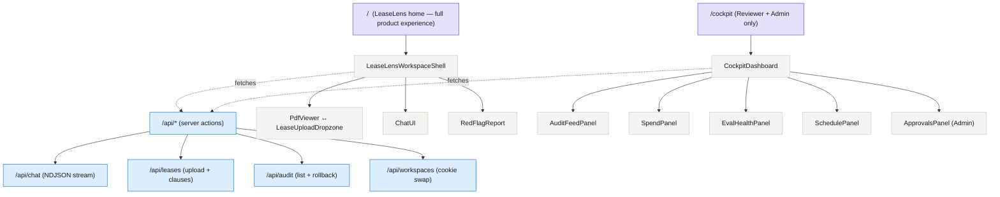
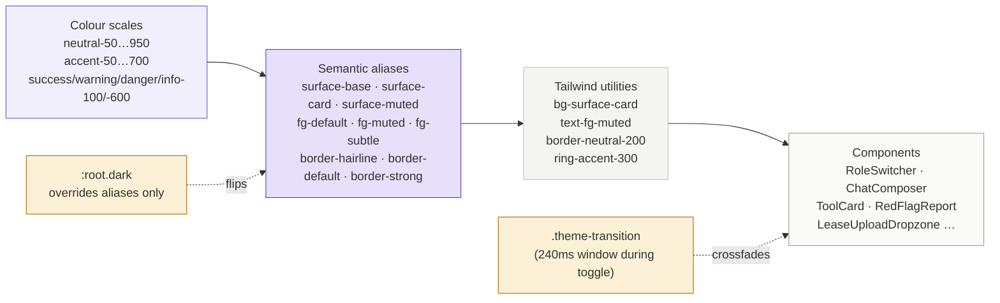
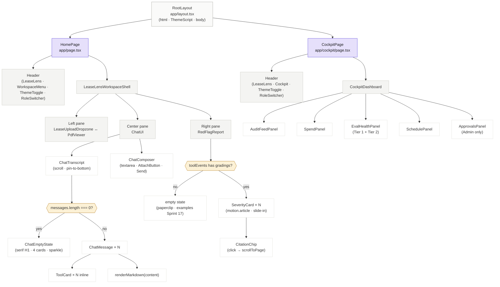

# LeaseLens Design System — Master Reference

**Status:** Sprint 16A v1 (design-system documentation). Documentation source of truth for LeaseLens UI/UX direction.
**Implementation source of truth:** [`src/app/globals.css`](../src/app/globals.css) (Tailwind v4 `@theme` block) and the existing component classNames.
**Last updated:** 2026-05-08.

> If a token value in this doc conflicts with `globals.css`, the CSS file wins. This doc documents *intent*; the runtime CSS is the *implementation*. Token names should be kept in sync — when one moves, both move.

---

## 1. Brand identity

### Archetype

**Primary — The Sage.** LeaseLens explains complicated lease language clearly. It should read as intelligent, grounded, educational, objective. Not flashy. Not chatty. Not condescending.

**Secondary — The Caregiver.** LeaseLens helps protect tenants from confusing, risky, or unfair lease terms before they sign. The interface should feel supportive, calm, reassuring — never alarmist, never patronising.

### Product promise

> **LeaseLens is a calm legal assistant that helps tenants understand lease risk before they sign.**

One sentence. Use this verbatim in marketing surfaces (hero subtitle, footer trust block). Avoid paraphrases that drift toward "AI lawyer", "legal advice", "instant approval", or other claims that overpromise.

### Voice & tone

| Trait | Do | Don't |
|---|---|---|
| **Plain-English** | "This deposit is two months' rent — NJ caps it at 1.5 months." | "Per N.J.S.A. §46:8-19(a), security deposits in excess of one-and-one-half month's rent are statutorily prohibited and may be deemed unenforceable." |
| **Active, not passive** | "LeaseLens flagged the security deposit." | "Several issues were identified by the system." |
| **Specific, not vague** | "4 high-severity red flags, 1 procedural gap." | "Multiple potential concerns detected." |
| **Tenant-respecting** | "You can ask for a polite redline of this clause." | "You should demand the landlord remove this." |
| **No legal advice** | "My understanding is that NJ generally requires…" | "This clause is illegal." |

The system prompt at [`src/lib/chat/system-prompt.ts`](../src/lib/chat/system-prompt.ts) and the negotiation-email template at [`src/lib/tools/lease-tools.ts`](../src/lib/tools/lease-tools.ts) already enforce a lot of this; the UI's microcopy must match.

### Legal-tech trust principles

1. **Never claim legal authority.** "Flag", "explain", "compare", "draft" — not "decide", "advise", "approve".
2. **Always cite.** Every severity grading carries a NJ statute citation enforced inside the tool — the UI surfaces it; never hide it.
3. **Always disclaim.** The `LEASELENS_DISCLAIMER` constant ([`src/lib/lease/disclaimer.ts`](../src/lib/lease/disclaimer.ts)) is the single source for the "not legal advice" wording. Used in the home page, chat empty state, system prompt, and any negotiation-email surface.
4. **Privacy by default.** Lease PDFs are session input — the binary isn't persisted; only parsed clauses go to SQLite. Surface this when relevant (upload-area microcopy, negotiation-email draft footer).

### Brand mark

Implementation: [`src/components/brand/LeaseLensMark.tsx`](../src/components/brand/LeaseLensMark.tsx).

The mark is a bespoke inline SVG of a document with three text lines and a magnifying glass overlapping the bottom-right corner. It literalises the product — a lens reviewing a lease — and replaces the generic lucide `FileSearch` that shipped through Sprint 17.1. Stroke is `currentColor`, so the mark inherits whatever text colour its container sets (white on the accent-600 badge in the chat header; accent-600 on neutral surfaces).

**Anatomy**

- 24 × 24 viewBox, all geometry stroke-based (no fills) so it scales cleanly from 14 px to 120 px without rasterising.
- Three text lines of varying width (`x2 = 14, 14, 11.5`) — a deliberate ragged-right that reads as natural prose, not a checklist.
- Magnifying glass `cx=17, cy=17, r=3` plus a `(19.2, 19.2) → (21, 21)` handle. The glass intentionally clips outside the document frame on the bottom-right; it should look like a tool reviewing the page, not a UI element inside it.

**Motion contract**

| Surface       | Default                                      | On hover                       | `prefers-reduced-motion`         |
| ------------- | -------------------------------------------- | ------------------------------ | -------------------------------- |
| Chat header   | One-shot scan sweep on mount (~900 ms ease-out-soft), then static | Lens scales to `1.08`, 220 ms | Static — no scan, no hover scale |
| Anywhere else | Pass `animated={false}` if the mark sits in a context that already has motion (cards animating in, etc.) | — | — |

The scan sweep is a thin horizontal stroke that translates `y: 5 → 18.5` with opacity `0 → 1 → 0` so it fades in, sweeps the document, and fades out at the bottom. It runs once per mount, never loops — legal-tech reads as calm, and a constantly-moving brand mark undercuts that. The `useReducedMotion()` gate is non-negotiable: users who opt out get the static frame and never see the sweep.

**Where the mark may appear**

- Chat home header — small, 14 px inside the accent-600 chip.
- Chat welcome state hero — large, 28 px inside a 56 px (`h-14 w-14`) `bg-accent-50` chip with a continuous 4-second "breathing" pulse on the surrounding badge. The mark inside still does its one-shot scan on mount; the badge pulse and the scan are independent layers and coexist cleanly.
- Loading splash, error pages, or external surfaces (favicon, README, share images) — always at minimum 14 px so the text lines remain legible.
- **Not** in the cockpit header — that view uses the lucide `Layers` icon with the "Operator Cockpit" wordmark, intentionally distinct from the chat surface so a glance tells you which view you're in.

**Anti-patterns**

- Don't fill the document or lens (we are stroke-only).
- Don't loop the scan animation.
- Don't recolour the scan stroke to a different hue (warning amber, danger red, etc.) — it's always `currentColor`.
- Don't combine the mark with a different wordmark — it's "LeaseLens" or nothing.

---

## 2. Colour system

Implementation lives in [`src/app/globals.css`](../src/app/globals.css)'s `@theme` block. The CSS file is canonical; the table below documents intent.

### Warm-neutral scale

| Token | Light hex | Role |
|---|---|---|
| `--color-neutral-50`  | `#FAFAF9` | page surface (light) |
| `--color-neutral-100` | `#F4F4F2` | muted surface (light) |
| `--color-neutral-150` | `#ECECE8` | divider |
| `--color-neutral-200` | `#E2E2DC` | default border |
| `--color-neutral-300` | `#C9C9C0` | strong border |
| `--color-neutral-400` | `#A3A39A` | subtle foreground |
| `--color-neutral-500` | `#75756B` | muted foreground |
| `--color-neutral-600` | `#565650` | secondary foreground |
| `--color-neutral-700` | `#3F3F3A` | strong foreground |
| `--color-neutral-800` | `#28282A` | card surface (dark) |
| `--color-neutral-900` | `#1A1A1C` | default foreground (light); muted surface (dark) |
| `--color-neutral-950` | `#0E0E10` | page surface (dark) |

Warm-neutral, not cold grey. Hint of yellow-green to read as paper rather than steel.

### Accent scale — keyed on `#6E5CE6`

| Token | Light hex | Role |
|---|---|---|
| `--color-accent-50`  | `#F2EFFD` | accent tint (hover bg) |
| `--color-accent-100` | `#E6E0FB` | accent soft (focus ring) |
| `--color-accent-200` | `#CFC4F7` | accent edge |
| `--color-accent-300` | `#B0A0F1` | accent ring (focus visible) |
| `--color-accent-400` | `#8A77EB` | accent strong |
| `--color-accent-500` | `#6E5CE6` | **brand primary** |
| `--color-accent-600` | `#5A47DC` | primary action |
| `--color-accent-700` | `#4B3AC0` | primary action hover |

Soft violet. Wide surface area is OUT of brand — the accent appears on the primary action, the sparkle icon, the active role pill, citation chips, and focus rings. Everything else stays neutral.

### Semantic colours (severity, status)

| Token | Light hex | Role |
|---|---|---|
| `--color-success-100` / `-600` | `#DDF4E6` / `#1F8B4C` | OK / Executed / Success |
| `--color-warning-100` / `-600` | `#FCF1D6` / `#B07410` | Medium severity / Undo affordance |
| `--color-danger-100` / `-600` | `#FBDFDF` / `#B33232` | High severity / Error |
| `--color-info-100` / `-600` | `#DBEEFD` / `#1E6FB8` | Low severity / Informational |

### Semantic aliases (theme-flip surfaces)

These alias the scales above and flip in dark mode via the `:root.dark` block in `globals.css`.

| Token | Light | Dark | Role |
|---|---|---|---|
| `--color-surface-base`   | `#FAFAF9` | `#0E0E10` | page background |
| `--color-surface-card`   | `#FFFFFF` | `#1A1A1C` | card / panel background |
| `--color-surface-muted`  | `#F4F4F2` | `#28282A` | hover surface, inline code background |
| `--color-fg-default`     | `#1A1A1C` | `#F4F4F2` | primary text |
| `--color-fg-muted`       | `#75756B` | `#A3A39A` | secondary text |
| `--color-fg-subtle`      | `#A3A39A` | `#75756B` | placeholder, hint text |
| `--color-border-hairline` | `rgb(0 0 0 / 0.08)` | `rgb(255 255 255 / 0.08)` | hairline 1px stroke |
| `--color-border-default` | `#E2E2DC` | `#28282A` | standard border |
| `--color-border-strong`  | `#C9C9C0` | `#3F3F3A` | emphasised border |

Components consume these via Tailwind utilities (`bg-surface-base`, `text-fg-default`, `border-border-hairline`). No raw hex values in component className. No raw `gray-*` / `indigo-*` from Tailwind's default scales.

### Contrast expectations

Body text (14px+ regular weight or 18px+ light weight) must clear **4.5:1 contrast** in both schemes. Token pairings verified:

| Foreground / Background (light) | Ratio |
|---|---|
| `--color-fg-default` (`#1A1A1C`) on `--color-surface-base` (`#FAFAF9`) | ~15.8:1 ✅ |
| `--color-fg-muted` (`#75756B`) on `--color-surface-base` | ~4.85:1 ✅ |
| `--color-accent-600` (`#5A47DC`) on `--color-surface-base` | ~7.1:1 ✅ |
| `--color-danger-600` on `--color-danger-100` | ~5.2:1 ✅ |

Equivalent pairs hold in dark mode. **`--color-fg-subtle` is below AA for body text** and is reserved for placeholders, hint text, and decorative ghosts — never for content the user needs to read.

---

## 3. Typography

Three families load via `next/font/google` in [`src/app/layout.tsx`](../src/app/layout.tsx) and bind to CSS variables consumed by the `@theme` block.

### Families

| Token | Family | Use |
|---|---|---|
| `--font-sans`  | **Geist Sans** | All UI: nav, buttons, labels, body, transcript, dropzone copy. |
| `--font-serif` | **Source Serif 4** | Editorial headings only: the empty-state H1, any landing-style hero. NEVER body. |
| `--font-mono` | **Geist Mono** | Statute citations (`NJ Stat 46:8-19`), tool names, technical identifiers, code blocks, tabular numbers (when paired with `font-variant-numeric: tabular-nums`). |

Body sets `font-feature-settings: "ss01", "cv11"` to engage Geist's small caps + alt 6/9 glyphs — improves readability for numeric statute IDs.

### Type scale

| Class | Size / Line | Use |
|---|---|---|
| `text-xs`  | 12px / 16px | helpers, eyebrow labels, hint text |
| `text-sm`  | 14px / 20px | secondary body, tertiary nav, dense rows |
| `text-base`| 16px / 24px | primary body, chat messages |
| `text-lg`  | 18px / 28px | subhead, callout |
| `text-xl`  | 20px / 28px | minor section heading |
| `text-2xl` | 24px / 32px | empty-state H1 base size |
| `text-3xl` | 30px / 36px | empty-state H1 desktop |
| `text-4xl` | 36px / 40px | hero (if landing-style hero exists) |
| `text-5xl` | 48px / 1.05 | hero desktop |

### Tracking

- Display sizes (`text-3xl`+): `tracking-tight` (-0.025em). Editorial weight.
- Body sizes: default (`tracking-normal`). No tightening.
- Eyebrow / uppercase labels (e.g. "RED FLAGS"): `tracking-[0.14em]` to `tracking-wider`.

### Tabular numerals

Use the `.tabular` utility (defined in `globals.css` `@layer utilities`) anywhere numbers need to align in a column or change without layout shift:

- workspace count badges
- audit-row timestamps
- spend panel `$` values
- eval-health percentages
- pass/fail counts ("10 / 12 passed")

---

## 4. Spacing, radius, border, shadows

### Spacing

Tailwind defaults (4px base). No custom overrides. Standard rhythms:

| Context | Vertical gap |
|---|---|
| Tight (within a card, between badge + label) | `gap-1` / `gap-1.5` |
| Default (paragraphs, between list items) | `gap-2` / `gap-2.5` |
| Section (between cards, between major blocks) | `gap-4` / `gap-6` |
| Page (between header + content, between page sections) | `gap-8` / `py-8` |

Horizontal padding: `px-3` for compact rows, `px-4` for cards, `px-6` for page chrome, `px-8` for desktop hero / header.

### Radius

| Token | px | Use |
|---|---|---|
| `--radius-sm`  | 4 | tags, pills |
| `--radius-md`  | 6 | small badges |
| `--radius-lg`  | 8 | buttons, cards |
| `--radius-xl`  | 10 | composer, prominent cards |
| `--radius-2xl` | 12 | dropzone, hero surfaces |
| `--radius-3xl` | 16 | icon containers, large hero blocks |

Avoid raw `rounded-full` except for severity-dot indicators and circular badges.

### Borders

- Default: `border-neutral-200 dark:border-neutral-800` (Tailwind utilities reading the tokens).
- Hairline (shadow-style): `shadow-hairline` — a 1px inner stroke from the `--shadow-hairline` token.
- Emphasis: `border-neutral-300 dark:border-neutral-700`.
- **No double borders.** Cards are either bordered (hairline) OR lifted (subtle shadow), never both.

### Shadows

Two tokens only.

| Token | Value | Use |
|---|---|---|
| `--shadow-hairline` | `0 0 0 1px var(--color-border-hairline)` | replaces `shadow-sm`; clean 1px stroke without colour bleed |
| `--shadow-lift` | `0 2px 8px rgb(0 0 0 / 0.06)` | hover lift, popovers, sticky bottoms |

**No bloom shadows.** Cards lift via a 2px Y translate (`whileHover={{ y: -2 }}`), not by growing a shadow halo.

---

## 5. Motion

### Duration tokens

| Token | ms | Use |
|---|---|---|
| `--duration-90`  | 90  | hover colour swaps |
| `--duration-120` | 120 | focus-within border crossfade |
| `--duration-150` | 150 | hover lift, role-pill slide |
| `--duration-200` | 200 | dropzone state changes |
| `--duration-220` | 220 | ToolCard expand/collapse |
| `--duration-250` | 250 | chat-message entry, theme transition |
| `--duration-350` | 350 | sparkle / one-shot pulse |

### Easings

- `--ease-out-soft` (`cubic-bezier(0.22, 1, 0.36, 1)`) — default for all UI transitions.
- `--ease-in-out-soft` (`cubic-bezier(0.45, 0, 0.55, 1)`) — for loops (sparkle).
- **Never `linear`** for UI. Linear reads as mechanical and is the most common amateur tell.

### Spring conventions (motion library)

For natural physics on hover/tap or `layoutId` transitions:

```ts
{ type: 'spring', stiffness: 300–500, damping: 25–30 }
```

Stiffness 400 + damping 30 for the role-pill `layoutId`. Stiffness 500 + damping 25 for the send-button `whileTap`. Never let a spring overshoot beyond 1.08 scale — that reads as bouncy / playful.

### Reduced motion contract

Every motion site uses the `useReducedMotion()` + DOM-swap pattern (see [`ChatMessage.tsx`](../src/components/chat/ChatMessage.tsx) for the canonical implementation):

```ts
const reduced = useReducedMotion();
const [mounted, setMounted] = useState(false);
useEffect(() => setMounted(true), []);
const animate = mounted && !reduced;

return animate ? <motion.div ... /> : <div ... />;
```

When `prefers-reduced-motion: reduce` is set, the DOM renders the plain branch — **never a slowed animation**. The mounted-state guard prevents an SSR-vs-client motion flash. `data-motion="on" | "off"` is the stable test hook on every animated container.

### Theme flip

Toggling between light/dark crossfades over 220ms (background-color, border-color, color) via the `.theme-transition` class managed by [`ThemeToggle.tsx`](../src/components/auth/ThemeToggle.tsx). The class is removed after 240ms so per-element hover/focus animations stay snappy outside the toggle window.

### Anti-patterns

- ❌ Bouncing icons (`animate-bounce` on decorative SVGs)
- ❌ Spinning anywhere except loading indicators
- ❌ Infinite animations on decorative elements (the 4s sparkle on the empty-state icon is grandfathered AND gated by `prefers-reduced-motion`)
- ❌ Scale-on-hover that shifts surrounding layout (use `transform`, not `width`/`height`)
- ❌ Parallax or scroll-jacking — causes nausea, fails reduced-motion users

---

## 6. Component principles

### Composition

- **Small, focused components.** A single component should render one logical unit. If it grows beyond ~150 lines or develops > 4 distinct rendering branches, split it.
- **Reusable layout primitives.** `<PageShell>` / `<Container>` / `<Stack>` for outer structure. Defined in Sprint 16B.
- **Consistent state primitives.** `<EmptyState>` / `<LoadingState>` / `<ErrorState>` for the three asynchronous outcomes. Defined in Sprint 16B.
- **Hand-rolled.** No shadcn/ui, no headless-ui, no Radix beyond what `motion` already pulls in. The codebase is small enough that hand-rolled components are clearer than indirection through a library.

### Icons

- **Lucide React only.** All icons must come from `lucide-react`. The component imports the named icon, never an inline SVG path.
- **No emojis as icons.** Decorative emoji in body text are fine where they read as content (rare); icon slots in chrome must use Lucide.
- **Consistent sizing.** `h-3.5 w-3.5` for inline icons, `h-4 w-4` for buttons, `h-5 w-5` for medium, `h-6 w-6` to `h-7 w-7` for hero/empty-state spots.

### Class composition

- **Token-driven utilities only.** `bg-surface-card`, `text-fg-muted`, `border-neutral-200`. No raw hex values, no Tailwind default scale (`gray-*`, `indigo-*`).
- **Dark variants alongside light.** Every class that varies between schemes carries its `dark:` companion when the semantic alias doesn't fully cover it.
- **No `!important`** outside `globals.css`'s `.theme-transition` block (where it's per-file justified in `biome.json`).

### Frozen public API

Component props signatures and exported names stay frozen post-Sprint 15 unless a public-API change is explicitly part of a sprint scope. Internal rendering refactors are fine; renames need a separate refactor sprint with codemod.

---

## 7. Accessibility rules

### Contrast

- Body text: ≥ 4.5:1.
- Large text (18px+ regular, 14px+ bold): ≥ 3:1.
- Decorative elements (subtle borders, dividers): no minimum.
- Focus ring: must contrast against both the focused element AND its background. We use `ring-accent-300` with `ring-offset-2` so the offset creates separation regardless of the element's own colour.

### Focus

- Every interactive element must have a visible `focus-visible:ring-2 focus-visible:ring-accent-300 focus-visible:ring-offset-2` (light + dark equivalents).
- No `outline: none` without a replacement. Use `focus-visible:outline-none` paired with the `ring-*` utilities.
- Tab order must match visual order. If a flex/grid layout reorders elements visually, fix the tab order with `tabIndex` or by reordering DOM, not by overriding CSS.

### ARIA

- **Icon-only buttons** must carry `aria-label="..."` describing the action ("Switch role", "Send message", "Theme").
- **Semantic roles only when correct.** RoleSwitcher uses `role="group"`, NOT `role="tablist"`, because no tab panels follow the buttons — the role changes registry filtering, not visual content. The brief asked about tablist; we deliberately keep `group`.
- **`aria-describedby` for hint text** that isn't a label but adds context. Example: the composer's "Shift + Enter for new line" hint.
- **`role="status"` or `aria-live="polite"`** on async progress surfaces (typing indicator, scan progress).

### Severity is never colour-only

Red flag severity must always be paired with a text label ("High", "Med", "Low", "OK"). A user with red-green colour blindness reads the label; a screen reader reads the label. The colour is reinforcement, not the signal.

### Touch targets

Minimum **44 × 44px** for any tappable target on touch surfaces. The role-tab buttons (h-7) currently fall below this on mobile — flagged in the audit as a P2 mobile fix.

### Keyboard

- Every interactive element reachable via Tab.
- Esc closes popovers (WorkspaceMenu already implements).
- Enter and Space activate buttons (native HTML `<button>` handles this automatically — don't bind keyDown handlers that override).

---

## 8. Legal-tech disclaimer rules

### The single source

`LEASELENS_DISCLAIMER` constant at [`src/lib/lease/disclaimer.ts`](../src/lib/lease/disclaimer.ts):

> *"LeaseLens reviews NJ residential leases and grades clauses against NJ tenant-law sources. It is not a lawyer; its output is not legal advice. Before acting on any clause grading or draft email, consult a tenant attorney or your local NJ legal-aid clinic."*

### Surfaces that must show the disclaimer

| Surface | Treatment |
|---|---|
| Empty-state welcome (homepage workspace) | Short version in a subtle text-fg-muted block under the starter cards |
| System prompt | Verbatim — informs every model response |
| Negotiation-email draft | Visible in the ToolCard expanded body; also in the email itself (e.g. footer template) |
| Trust banner (if added in Sprint 17) | Verbatim, in a low-contrast surface near the upload CTA |
| README | Verbatim near the top of the file |

### What the disclaimer is NOT

- A scary modal blocking access. (Never modal-gate it.)
- An accept-terms checkbox. (We're not contracting; we're informing.)
- Hidden in a footer link only. (Must be visible alongside the action the user is about to take.)

### Forbidden copy

- "LeaseLens decides…" — replaces "LeaseLens flags…"
- "This clause is illegal." — replaces "My understanding is NJ generally…"
- "Required by law." — only the model's grading + statute citation says what's required; the UI never asserts.
- "Get instant legal approval." — never. We do not approve anything.

---

## 9. Anti-patterns (forbidden)

This list is the negative of the brief's "Visual Direction → Avoid" section, expanded with concrete examples.

| Anti-pattern | Why we reject | What to use instead |
|---|---|---|
| Generic law-firm navy + gold + EB Garamond | Sage archetype, not Authority archetype. We're not a firm. | Warm-neutral + soft violet + Geist + Source Serif 4 |
| Glassmorphism (backdrop-blur cards on busy backgrounds) | Reads as gimmicky; fails AA contrast easily | Flat cards with hairline borders |
| Heavy gradients (full-page bg gradients, gradient buttons) | Distracts from the legal-text content | Solid surface tokens |
| Emoji icons in chrome (🚀 ⚖️ 🏠) | Reads as toy / consumer; fails on screen readers | Lucide icons |
| Playful bouncing animations | Sage + Caregiver, not Jester | Subtle scale + opacity + translate |
| Linear easings | Mechanical, amateur | `var(--ease-out-soft)` |
| Infinite decorative animation | Distracting, fails reduced-motion | Single-shot pulse, or gated 4s loop with reduced-motion fallback |
| Modal-gated disclaimer | Hostile UX; blocks legitimate use | Inline alongside relevant action |
| `<select>` for high-stakes choices | Hides options; poor mobile UX | Cards or segmented controls |
| Toast-only error feedback | Easy to miss; auto-dismisses | Inline ErrorState in the affected surface |
| Redesigning every screen at once | High regression risk; loses trust | Phased sprints (16A docs → 16B primitives → 17 → 18 → 19) |
| Changing product behaviour during visual polish | Conflates concerns; hard to review | Behaviour changes go in their own sprint with tests |

---

## 10. Pre-delivery checklist

Every PR closes against this checklist. The first six categories are non-negotiable.

### Visual quality

- [ ] No emojis as icons (Lucide only)
- [ ] All icons sized consistently within their context (h-4 w-4 for buttons, h-3.5 w-3.5 inline)
- [ ] No raw hex colour values in component className
- [ ] No `gray-*` or `indigo-*` from Tailwind's default scale (use tokens)
- [ ] Borders + shadows: hairline OR lift, never both, never bloom
- [ ] No layout shift on hover (transform-only)

### Interaction

- [ ] `cursor-pointer` on every clickable element (global rule in `globals.css` + per-element where the rule needs reinforcement)
- [ ] Hover feedback visible (colour, background, or 2px lift)
- [ ] Transitions 90-350ms with `var(--ease-out-soft)`
- [ ] Disabled buttons clearly disabled (`disabled:opacity-35` standard) — and `cursor: default` returns

### Accessibility

- [ ] All images / icons have alt or `aria-hidden="true"`
- [ ] Form inputs have labels (visible OR `sr-only`)
- [ ] Icon-only buttons have `aria-label`
- [ ] Focus rings visible on every interactive surface in both schemes
- [ ] Tab order matches visual order
- [ ] Severity / state never communicated by colour alone
- [ ] `prefers-reduced-motion: reduce` renders plain DOM (no slowed animations)

### Responsiveness

- [ ] Tested at 375px, 768px, 1024px, 1440px
- [ ] No horizontal scroll at any breakpoint
- [ ] Touch targets ≥ 44 × 44px on mobile
- [ ] Sticky / fixed elements respect safe-area-inset on iOS

### Light / dark mode

- [ ] All text clears 4.5:1 contrast in both schemes
- [ ] Borders visible in both schemes
- [ ] Accent stays in the same hue family (slight desaturation in dark is OK)
- [ ] Manual ThemeToggle cycles system → light → dark cleanly
- [ ] Theme flip crossfades over ~220ms (`.theme-transition` window)

### Build & quality gates

- [ ] `npm run typecheck` green
- [ ] `npm run lint` 0 errors
- [ ] `npm run test` ≥ 507/507 (pre-existing baseline)
- [ ] No regressions in Playwright E2E

---

## 11. Information architecture (Mermaid)



---

## 12. Token relationships (Mermaid)



---

## 13. User journey (Mermaid)

Canonical happy-path: a tenant lands on `/`, uploads a lease, runs the standard scan, reviews red flags, and drafts a negotiation email. Annotated with the tool name + audit outcome at each step.

```mermaid
flowchart LR
    Land(["Visitor lands on / — sees welcome state + dropzone"])
    Upload["Drops PDF onto left pane<br/>(POST /api/leases)"]
    Parse["Server parses + segments + classifies clauses<br/>(parse-pdf · segment-clauses · classify-clause)"]
    Ready["Lease ready: PdfViewer replaces dropzone<br/>(active_lease_id set on conversation)"]
    Ask["Sends 'Run the standard scan' from composer"]
    Extract["Iteration 1: extract_clauses tool<br/>(read-only · no audit row)"]
    Grade["Iterations 2–N: grade_clause_severity per clause<br/>(citation-grounded · no audit row)"]
    Report["RedFlagReport populates as gradings stream in<br/>(sorted by severity)"]
    Review["Tenant reviews flags · clicks citation chip<br/>(scrollToPage + 4s ring pulse)"]
    Draft["Asks 'Draft a polite email for clause X'"]
    Email["draft_negotiation_email tool<br/>(mutating · audit row + Undo button)"]

    Land --> Upload --> Parse --> Ready
    Ready --> Ask --> Extract --> Grade --> Report --> Review
    Review --> Draft --> Email
    Email -. Undo .-> Review

    classDef start fill:#fafaf9,stroke:#a3a39a
    classDef readonly fill:#dbeefd,stroke:#1e6fb8
    classDef mutating fill:#fcf1d6,stroke:#b07410
    classDef result fill:#ddf4e6,stroke:#1f8b4c

    class Land,Ready,Review start
    class Upload,Parse,Ask,Extract,Grade readonly
    class Draft,Email mutating
    class Report result
```



Key UX invariants surfaced by this journey:

- **No friction between landing and first action.** Steps 1 → 2 happen in the same viewport — no marketing-page detour.
- **No audit rows on read-only steps.** `extract_clauses` + `grade_clause_severity` are observation; only `draft_negotiation_email` mutates.
- **Citation grounding gate.** Step 5 (Grade) is the only place an Anthropic-driven citation must verify against retrieval before the result reaches the user.
- **Reversibility on every mutation.** The Undo button on the draft email's ToolCard is the user's safety net.

---

## 14. Component hierarchy (Mermaid)

The component tree from RootLayout down to the leaf cards. Only the LeaseLens-specific surfaces; framework-level shells (Next's metadata, theme script) are noted but not exploded.



Reading this tree confirms the design-system primitives Sprint 16B will extract:

- **`<PageShell>`** abstracts the repeating Layout → Page → Header → Main pattern (HomePage + CockpitPage both implement this inline today).
- **`<EmptyState>`** has three current callers (ChatEmptyState, RedFlagReport empty, dropzone idle) plus future callers (paste-text fallback states, Sprint 19).
- **`<LoadingState>`** has one caller today (ToolCard pending body) and two known callers in Sprint 18 (red-flag skeleton cards, scan-progress indicator).
- **`<ErrorState>`** has one caller (dropzone error state) and two future callers (chat-route 5xx, paste-text ingestion errors).

---

**End of MASTER.md.**

Page-level overrides live in [`design-system/pages/`](pages/). Audit + sprint plan live in [`docs/ui-ux-audit.md`](../docs/ui-ux-audit.md) and [`docs/ui-ux-modernization-plan.md`](../docs/ui-ux-modernization-plan.md). When the design direction changes, update this file in the same commit as the code so they stay in sync.
